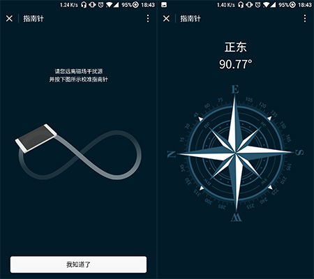

## 小程序 -- 指南针

有这个想法是因为最近入了一加的坑，感叹氢OS简洁的同时发现系统也缺少了很多小工具。下第三方App又嫌麻烦，占空间不说，每次都要从大堆的软件列表里找App，着实不方便。遂谋生了用小程序自己做，这些有用，但是不常用的小工具。这里开始做第一个小工具 -- 指南针。

项目已经上线，大家可以在微信中搜索“迷你指南针”，或扫描下方二维码查看体验（只能用摄像头扫描二维码，不可图片识别二维码）。


**注意：本代码开源仅供学习交流。盗版必究！！！**


### V1.0

第一版设想是用两个页面，第一个页面用于提示校准电子罗盘，页面跳转主页面时使用redirectTo销毁提示页面。

先是用cdr做提示图和指南针的表盘。



用微信开发者工具创建项目。

项目结构如下：

```
├───app.js				    // 小程序逻辑
├───app.json				// 小程序公共设置
├───app.wxss				// 小程序公共样式
├───images					// 用来放置图片文件
└───pages					// 项目页面开发目录，里面的每个子目录代表一个独立页面
    ├───index				// index 页面目录
    │   ├───index.js	    // index 页面逻辑
    │  	├───index.wxml	    // index 页面结构
    │  	└───index.wxss	    // index 页面样式表
    └───compass				// logs 页面目录
    	├───compass.js			// logs 页面逻辑
    	├───compass.json		// logs 页面设置
    	├───compass.wxml		// logs 页面结构
    	└───compass.wxss		// logs 页面样式表
```

app.js在这里用不到，app.json声明页面，定义下小程序顶栏的样式，app.wxss定义了所有页面的背景。

index页面从上到下依次是提示文字，提示图，按钮；

js使用redirectTo({})销毁当前页面，跳转到下级页面。同时使用wx.getSystemInfoSync()接口获取机器型号，和屏幕可用高度，对安卓和ios做了兼容处理：

```
var res = wx.getSystemInfoSync()
var h
if (res.model.substring(0,6) == 'iPhone') {
  h = res.screenHeight - 64;
} else {
  h = res.screenHeight - 71;
}
this.setData({
  height: h + "px",
  text: h/4 - 60 + "px",
  pic: h/2 - 100 + "px",
  btn: h - 60 + "px"
})
```

compass页面从上到下依次为方向，角度，罗盘；

js除了使用了上面的高度处理之外，使用wx.onCompassChange() 调取电子罗盘Api获取数据，给页面赋值。

```
    // 罗盘Api
    var that = this;
    wx.onCompassChange(function (res) {
      var directions = res.direction.toFixed(2);
      that.setData({
        angle: directions,
        rotate: 360 - directions,
        direction: check(directions)
      })
    })
    // 判断文字
    function check(i){
      if(22.5<i && i<67.5){
        return '东北'
      }else if(67.5<i && i<112.5){
        return '正东'
      }else if(112.5<i && i<157.5){
        return '东南'
      }else if(157.5<i && i<202.5){
        return '正南'
      }else if(202.5<i && i<247.5){
        return '西南'
      }else if(247.5<i && i<292.5){
        return '正西'
      }else if(292.5<i && i<337.5){
        return '西北'
      }else{
        return '正北'
      }
    } 
```

页面的指南针旋转得益于小程序的数据驱动，使用style的内联样式放在页面中。

```
<image src="../../images/compass.png" style="transform: rotate({{rotate}}deg);"></image>
```


### V1.1

1，屏幕兼容性修复

在使用自己的设备调试页面高度是刚刚好铺满屏幕的，但是后来发现安卓的碎片化真的太严重，有些机型下面依然会有难看的白条。遂找到另外一种方法：

平时我们在处理浏览器页面常用height: 100%; 来让页面铺满屏幕，其实小程序也是可以使用的，虽然小程序宣称没有Dom，不能直接操作Dom，但是切到调试页面的Wxml选项卡查看页面结构会发现小程序的页面包裹在<page>标签中。这里倒是和HTML的<body>很像嘛。尝试在app.wxss中添加page{height: 100%}，页面成功铺满屏幕。这样就不需要区分机型了，简单省事。

```
/**app.wxss**/
page {
  height:100%;
  background-color: #011b28;
}
```

2，硬件确认提醒

虽然电子罗盘在手机上基本得到了普及，但是在一些老旧机型上依然没有，这样小程序就不能用了，所以这里对没有电子罗盘的机型做了处理，当获取到的罗盘数据为undefined时弹窗提醒用户。实际测试发现如果手机没有电子罗盘，代码不会执行wx.onCompassChange()，而使用wx.startCompass()的话，不管有没有电子罗盘都会走成功的回调函数。

最后解决方案为，给方向和度数附一个初始值，如果手机有电子罗盘就会修正这些值，否则系统获取不到电子罗盘数据这个数值就一直是原始值。通过这样的方法我们可以间接知道用户手机是否支持电子罗盘。从而达到提醒用户的目的。

```
// 判断手机是否有陀旋仪
// 外部检测，如果没有陀旋仪数据，代码不会进入wx.onCompassChange
// 必须使用setsetTimeout包裹代码，否则会在更新电子罗盘数据前执行弹窗
// 部分手机电子罗盘数据调用过慢，这里给两秒反应时间
setTimeout(function(){
	if(that.data.direction == '--' && that.data.angle == '--'){
		wx.showToast({
			title: '您的手机没有电子罗盘或被禁用',
			icon: 'loading',
			duration: 5000,
			mask: true
		})
	}
},2000)
```


### V1.2

1，加入分享功能

可能大家都会遇到这样的场景：和朋友出去玩，你早早到了约定的地方，然后发微信问你的朋友，他回你找不到路了。你告诉怎么怎么走，但是他说我不知道北啊？！这时你就可以优雅的打开小程序，分享给你的朋友，让他从此再也不会找不着北！

2，数据取整

之前版本取到指南针数据为保留两位小数，但是太过精确会导致指针转动太快，给人不舒服的感觉，所以调整为四舍五入，取整数处理。上方角度数据依然保留两位小数。

3，角度调整

之前版本是把360度分成八大方向，每个45度。这里修改为四大主方向为30度，偏方向为60度。


### V1.3

加入"不再提醒"按钮，用户可选择永久关闭提示页面。

同时对提示页面布局进行调整，放弃之前使用的js获取系统屏幕宽高的处理方式，使用纯css，提高渲染效率。


### V1.4

将页面颜色全部数据化，添加主题更换按钮控制页面各部分的颜色。增加弹窗做版本更新提醒和校准提醒。

坑：小程序从本地获取数据，如果该数据不存在，将返回空，但是此时空值==0为true，建议使用===来判断，防止此类事情发生。